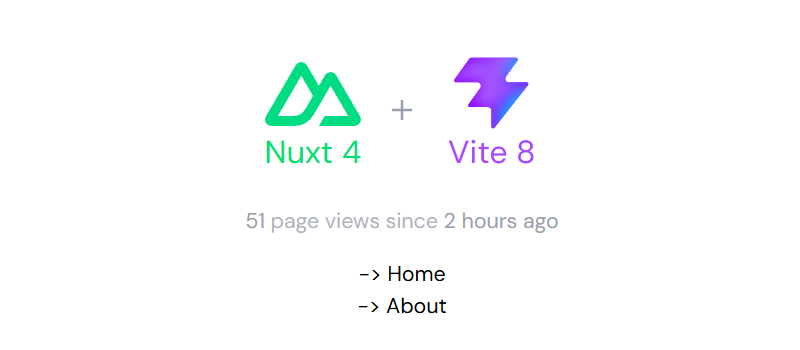

<p align="center">

</p>

<h2 align="center">
<a href="https://github.com/antfu/vitesse">Vitesse</a> Starter for Nuxt 4
</h2><br>

<p align="center">
<a href="https://stackblitz.com/github/lumirelle/starter-vitesse-nuxt"></a>
</p>

> [!Note]
>
> `main` branch of this starter is currently migrate to [bun](https://bun.com/), if you want to use `nodejs` version, please check out the [`nodejs` branch](https://github.com/lumirelle/starter-vitesse-nuxt/tree/nodejs).
>
> See [Bun vs. Node.js comparison table](https://strapi.io/blog/bun-vs-nodejs-performance-comparison-guide).
>
> Migration progress:
>
> - [x] Package Manager: `pnpm` -> `bun`
> - [ ] Build Tool: Still using `vite` + `rolldown`
> - [ ] Test Runner: Still using `vitest`
> - [x] Deploy Environment Support: `netlify` and `stackblitz`

> [!Note]
>
> This is a personal fork of [antfu/vitesse-nuxt](https://github.com/antfu/vitesse-nuxt) with some customizations.

## Features

### Framework

- 💚 [Nuxt 4](https://nuxt.com/)
  - 🛟 Server-Side Rendering (SSR);
  - 📦 Edge Side Rendering (ESR): &ndash; Zero-config cloud functions and deploy.
  - 🗺️ File-based routing;
  - 📡 API (components, composables, utils, ...) auto importing;
  - 🧩 Modules system;
  - 🏗️ [Layout system](./app/layouts);
  - ...etc.

- ⚡️ [Vite 8 (Rolldown)](https://vite.dev/) &ndash; A blazing fast frontend build tool powering the next generation of web applications.

- 🌳 [Vue 3](https://vuejs.org/) &ndash; An approachable, performant and versatile framework for building web user interfaces.

### Search Engine Optimization (SEO)

- 🕷️ [Nuxt SEO](https://github.com/harlan-zw/nuxt-seo) &ndash; Fully equipped Technical SEO for busy Nuxters.

### Progressive Web App (PWA)

- 📱 [Vite PWA](https://github.com/vite-pwa/nuxt) - Zero-config PWA Plugin for Nuxt.

### User Interface

- 🎨 [UnoCSS](https://github.com/unocss/unocss) &ndash; The instant on-demand atomic CSS engine.

- 😃 Use icons from any icon sets, even [locally](./public/icons/) in Pure CSS, powered by [UnoCSS](https://github.com/unocss/unocss).

- 🔤 [Nuxt Fonts](https://github.com/nuxt/fonts) &ndash; Plug-and-play web font optimization and configuration for Nuxt apps.

- 🖼️ [Nuxt Image](https://github.com/nuxt/image) &ndash; Plug-and-play image optimization for Nuxt applications.

- 🌐 [Nuxt I18n](https://github.com/nuxt-modules/i18n) &ndash; Internationalization (i18n) for Nuxt apps.

- 🎨 [Nuxt Color Mode](https://github.com/nuxt-modules/color-mode) &ndash; Dark and Light mode with auto detection.

### Development Experience

- 💪🏻 [TypeScript](https://www.typescriptlang.org/), of course.

- 🍍 [Pinia](https://github.com/vuejs/pinia) &ndash; State Management, see [./app/composables/useStore.ts](./app/composables/useStore.ts).

- 🫴🏻 [Vue Use](https://github.com/vueuse/vueuse) &ndash; Collection of useful composition functions for Vue.

- 📜 [Scripts](https://github.com/nuxt/scripts) &ndash; Better Privacy, Performance, and DX for Third-Party Scripts in Nuxt Apps.

- 🧰 [DevTools](https://github.com/nuxt/devtools) &ndash; Unleash Nuxt Developer Experience.

- 🕵️ [ESLint](https://github.com/nuxt/eslint) &ndash; Provides Nuxt related ESLint rules.

- 📝 [Hints](https://github.com/nuxt/hints) &ndash; Provides real-time feedback on your application's performance, accessibility, and security right in your browser.

- ♿ [A11y](https://github.com/nuxt/a11y) &ndash; Provides real-time accessibility feedback and automated testing right in your browser during development.

- 🧪 [Test Utils](https://github.com/nuxt/test-utils) - Utilities for testing Nuxt applications.

## IDE

We recommend using [VS Code](https://code.visualstudio.com/) with [Volar](https://github.com/vuejs/language-tools.git) to get the best experience.

## Variations

- [vitesse](https://github.com/antfu/vitesse) - Opinionated Vite Starter Template
- [vitesse-lite](https://github.com/antfu/vitesse-lite) - Lightweight version of Vitesse
- [vitesse-nuxt-bridge](https://github.com/antfu/vitesse-nuxt-bridge) - Vitesse for Nuxt 2 with Bridge
- [vitesse-webext](https://github.com/antfu/vitesse-webext) - WebExtension Vite starter template

## Try it now!

### Online

<a href="https://stackblitz.com/github/lumirelle/starter-vitesse-nuxt"></a>

### GitHub Template

[Create a repo from this template on GitHub](https://github.com/lumirelle/starter-vitesse-nuxt/generate).

### Clone to local

If you prefer to do it manually with the cleaner git history

```bash
bunx -b degit lumirelle/starter-vitesse-nuxt my-nuxt-app
cd my-nuxt-app
bun i # If you don't have bun installed, run: npm install -g bun or install via https://bun.sh/
```
